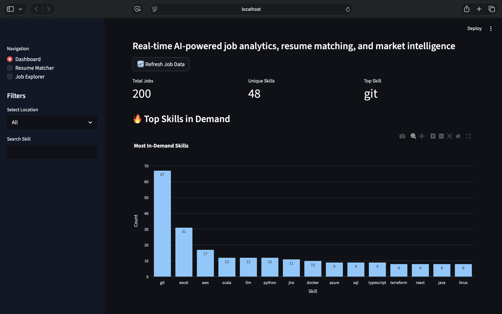
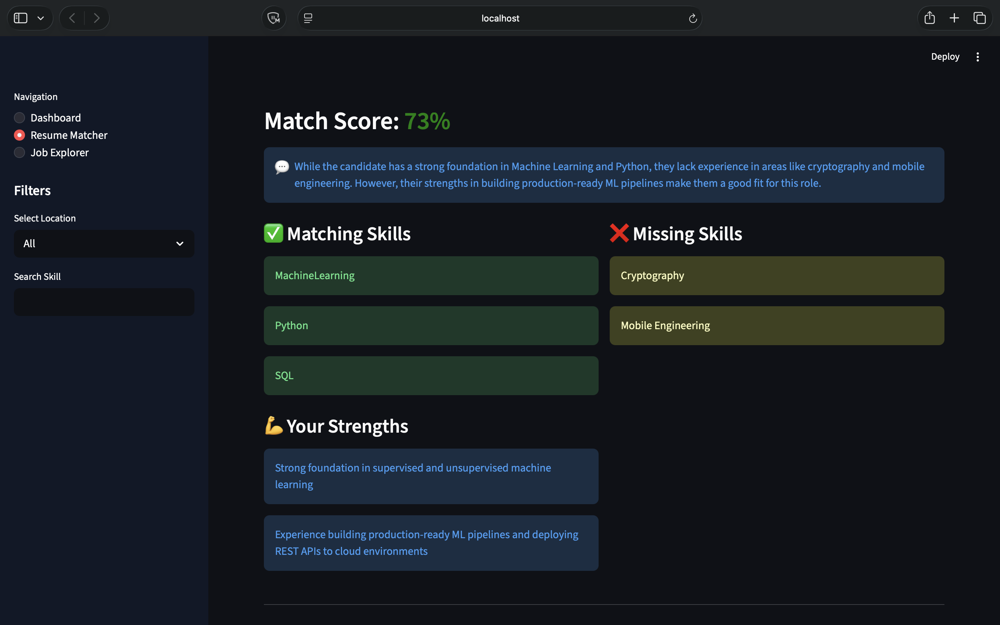
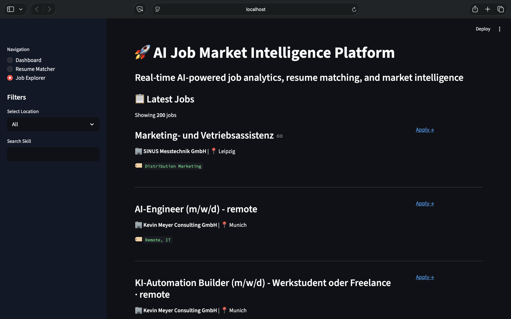

# 🚀 AI Job Market Intelligence Platform

> An end-to-end AI-powered data platform that ingests real-time job postings, extracts in-demand skills using NLP, and intelligently matches resumes against live opportunities using a locally hosted LLM — built entirely with free and open-source tools.

## 📸 Screenshots

### Dashboard — Market Intelligence


### AI Resume Matcher


### Job Explorer

---

## 🎯 Why I Built This

I built this tool to solve my own problem.

As a Data Scientist actively job hunting in Berlin, I was spending hours every day manually reading job descriptions, trying to figure out which skills were most in demand and whether my resume was a good fit for each role.

So I built a platform that does it automatically.

This project demonstrates my ability to build and ship a complete data product — from API ingestion and data pipeline design through NLP skill extraction, LLM integration, and interactive dashboard deployment.

---

## ✨ What It Does

### 📊 Market Intelligence Dashboard
- Scrapes real-time job postings from live APIs daily
- Extracts and ranks the most in-demand technical skills across hundreds of job descriptions
- Visualises hiring trends by company, location, and skill category
- One-click data refresh to pull the latest job market data

### 🧠 AI Resume Matcher
- Upload your resume in PDF, DOCX, or TXT format
- Paste any job description
- Get an AI-generated match score, matching skills, missing skills, and a one-sentence recommendation
- Powered by LLaMA 3.2 running locally via Ollama — **completely free, no API costs**

### 🔍 Job Explorer
- Browse all scraped job postings with live filters
- Filter by location and skill keyword
- Clickable Apply links directly to each role

---

## 🏗️ System Architecture

```
┌─────────────────────────────────────────────────────┐
│                   DATA PIPELINE                      │
│                                                      │
│  Arbeitnow API  ──►  scrape_jobs.py  ──►  jobs.csv  │
│                              │                       │
│                              ▼                       │
│              extract_skills.py (NLP)                 │
│                              │                       │
│                              ▼                       │
│                    skills_analysis.csv               │
└─────────────────────────────────────────────────────┘
                              │
                              ▼
┌─────────────────────────────────────────────────────┐
│                  STREAMLIT DASHBOARD                 │
│                                                      │
│  ┌─────────────┐  ┌──────────────┐  ┌────────────┐ │
│  │  Dashboard  │  │ Resume Match │  │  Explorer  │ │
│  │  Charts &   │  │  LLaMA 3.2   │  │  Filter &  │ │
│  │  KPIs       │  │  via Ollama  │  │  Browse    │ │
│  └─────────────┘  └──────────────┘  └────────────┘ │
└─────────────────────────────────────────────────────┘
```

---

## 🛠️ Tech Stack

| Layer | Technology | Purpose |
|---|---|---|
| **Data Ingestion** | Python · Requests | Scrape job postings from live APIs |
| **Data Processing** | Pandas · Regex · NLP | Clean, transform, extract skills |
| **AI Matching** | Ollama · LLaMA 3.2 | Local LLM for resume matching — free |
| **Resume Parsing** | pdfplumber · python-docx | Extract text from PDF/DOCX/TXT |
| **Visualisation** | Plotly · Streamlit | Interactive charts and dashboard |
| **Storage** | CSV · File System | Lightweight persistent data store |
| **Version Control** | Git · GitHub | Source control and collaboration |

---

## 📁 Project Structure

```
job-market-intel/
│
├── scraper/
│   └── scrape_jobs.py          # Fetches jobs from Arbeitnow API
│
├── backend/
│   └── extract_skills.py       # NLP skill extraction and counting
│
├── data/
│   ├── jobs.csv                # Raw job postings (generated)
│   └── skills_analysis.csv     # Skill frequency analysis (generated)
│
├── dashboard.py                # Streamlit multi-page dashboard
├── requirements.txt            # Python dependencies
└── README.md
```

---

## ⚙️ Setup & Installation

### Prerequisites
- Python 3.10+
- [Ollama](https://ollama.com) installed on your machine

### Step 1 — Clone the repository

```bash
git clone https://github.com/gandhisarthak/job-market-intel.git
cd job-market-intel
```

### Step 2 — Create virtual environment

```bash
python3 -m venv venv
source venv/bin/activate        # Mac/Linux
venv\Scripts\activate           # Windows
```

### Step 3 — Install dependencies

```bash
pip install -r requirements.txt
```

### Step 4 — Install and start Ollama

```bash
# Download Ollama from https://ollama.com
# Then pull the free LLaMA model
ollama pull llama3.2

# Start Ollama in background
ollama serve
```

### Step 5 — Run the data pipeline

```bash
# Step 1: Scrape latest job postings
python scraper/scrape_jobs.py

# Step 2: Extract skills from job descriptions
python backend/extract_skills.py
```

### Step 6 — Launch the dashboard

```bash
streamlit run dashboard.py
```

Open your browser at **http://localhost:8501**

---

## 🚀 Usage

### Daily Data Refresh
Click the **🔄 Refresh Job Data** button on the Dashboard page to automatically scrape the latest jobs and re-run skill extraction.

### Resume Matching
1. Go to the **Resume Matcher** page
2. Upload your resume (PDF, DOCX, or TXT)
3. Paste a job description you want to apply for
4. Click **🤖 Analyse with AI**
5. Get your match score, missing skills, and recommendation in seconds

### Job Explorer
1. Go to the **Job Explorer** page
2. Use the sidebar filters to search by location or skill keyword
3. Click **Apply →** on any role to go directly to the job posting

---

## 💡 Key Technical Decisions

**Why Ollama instead of a paid API?**
Using a locally hosted LLaMA 3.2 model makes the tool completely free to run with no ongoing API costs — and demonstrates understanding of local LLM deployment, which is increasingly relevant in enterprise ML engineering.

**Why CSV instead of a database?**
Lightweight local storage keeps the setup simple and dependency-free. The pipeline is designed to be easily migrated to PostgreSQL or SQLite for production deployment.

**Why Arbeitnow API?**
It's a legitimate, well-maintained job board API with English-friendly role filtering — directly relevant to the target use case of finding English-first data roles in Germany.

---

## 📈 Sample Output

**Top skills extracted from 500+ job postings:**

| Rank | Skill | Frequency |
|---|---|---|
| 1 | Python | 387 |
| 2 | SQL | 312 |
| 3 | Machine Learning | 245 |
| 4 | AWS | 198 |
| 5 | Docker | 187 |

**AI Resume Match example output:**
```json
{
  "match_score": 78,
  "matching_skills": ["Python", "SQL", "Machine Learning", "Docker"],
  "missing_skills": ["AWS", "Spark", "dbt"],
  "strengths": [
    "Strong ML deployment experience with live API",
    "End-to-end pipeline design demonstrated",
    "Production-ready FastAPI experience"
  ],
  "recommendation": "Strong technical match — focus on cloud platform experience to close the remaining gap."
}
```

---

## 🔮 Planned Improvements

- [ ] Migrate CSV storage to SQLite / PostgreSQL
- [ ] Add daily automated scraping via cron job
- [ ] Add email alerts for new matching jobs
- [ ] Expand to multiple job board APIs (RemoteOK, Wellfound)
- [ ] Add salary trend analysis by role and location
- [ ] Deploy to Hugging Face Spaces for public access

---

## 👨‍💻 About the Author

**Sarthak Gandhi** — Data Scientist based in Berlin, Germany.

BSc Computer Science — Berlin School of Business and Innovation (2026)

I build end-to-end ML systems — from data ingestion and feature engineering through model training, evaluation, and production deployment.

- 🔗 [LinkedIn](https://linkedin.com/in/sarthakgandhi02)
- 💻 [GitHub](https://github.com/gandhisarthak)
- 📧 sarthakmgandhi@gmail.com
- 🌐 Open to Data Scientist and Data Analyst roles in Berlin and remote

---

## 📄 License

MIT License — feel free to fork, use, and build on this project.